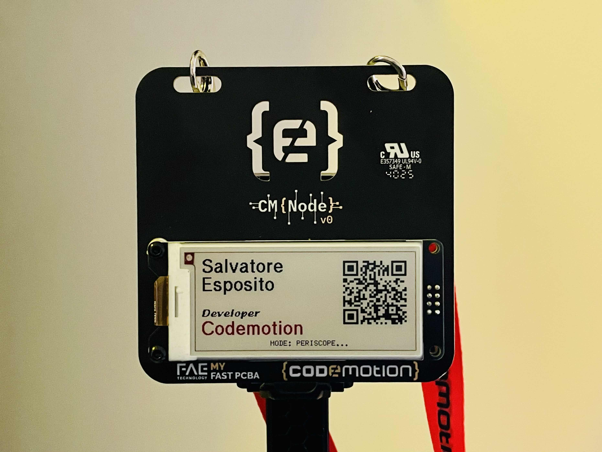
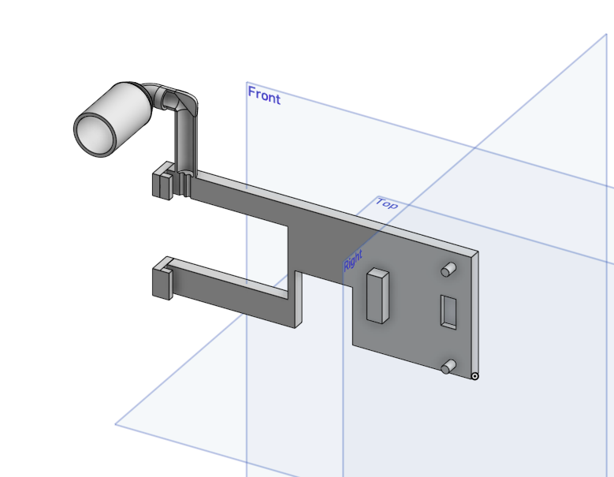
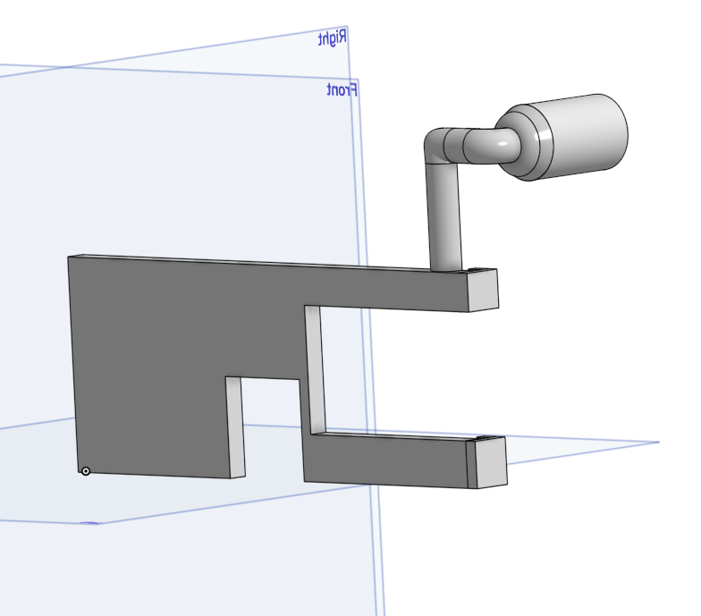
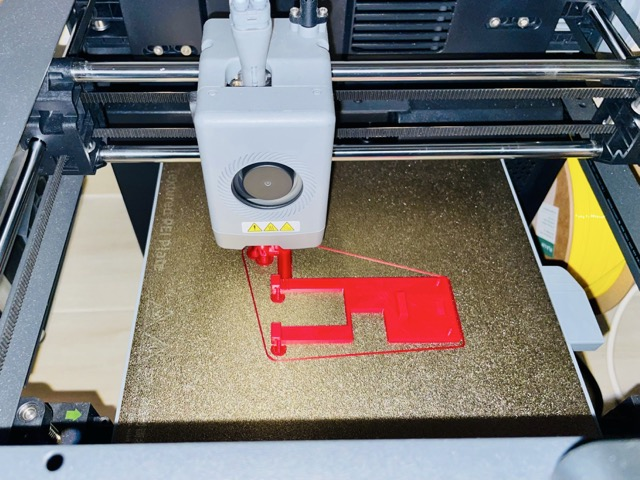
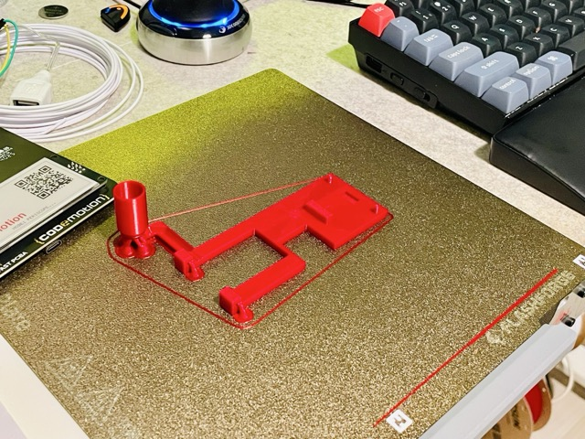
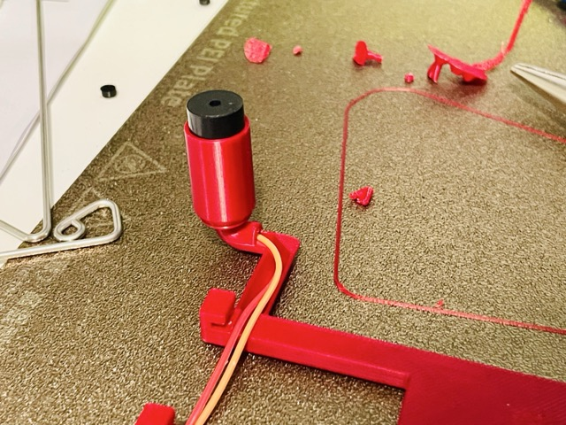
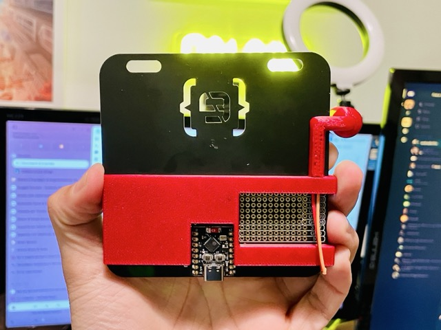
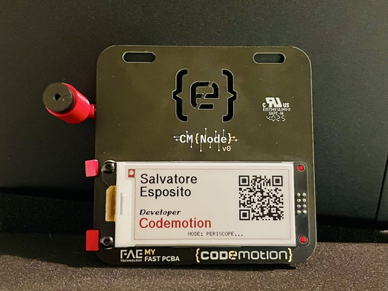
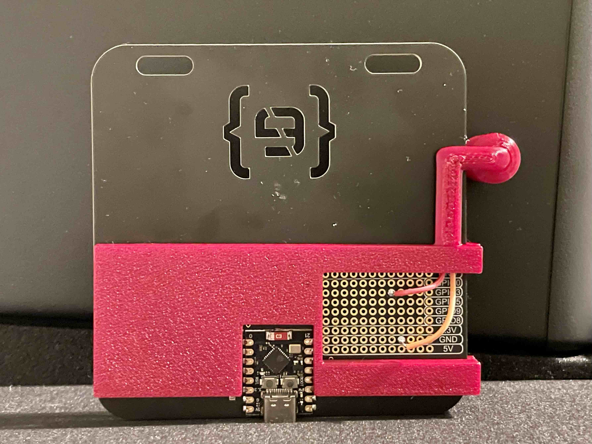

🛰️ ESP32 Social Periscope (Radar Badge)
========================================

### 🔗 Project Context & Evolution

This experiment is based on the **[Codemotion Smart Badge](https://github.com/Codemotion-Official/CMNode)**. It was born from the idea of hacking and developing custom add-ons for the **CMNode V0** version.

While the original project was designed for **passive operation** (displaying check-in data), this "Social Periscope" version evolves the hardware into an **active device** capable of real-time peer-to-peer detection and interaction.



## Overview: The "Active" Evolution

This firmware transforms the static badge into an interactive **Social Radar**. It uses **ESP-NOW** and **RSSI (Signal Strength)** monitoring to detect other nearby badges, automatically swapping contact information when you get close to another attendee.


📹 **[Watch full demo video on YouTube](https://youtu.be/3y3iBChB-LI)**

### Key Logic Overview

1.  **Broadcast**: Every 300ms, the device sends its own profile data to any nearby device.
2.  **Detection (Proximity Alert)**: It calculates a "Smooth RSSI" (signal strength). As a peer gets closer, the buzzer beeps faster and at a higher pitch (Geiger-counter style).
3.  **Target Acquisition**: If a peer is very close (RSSI > -80), it triggers a 5-second alarm and then updates the E-Paper display with the "Target's" information and QR code.

### 🚀 How It Works

1.  **Broadcast Mode**: The device constantly broadcasts your profile (Name, Role, Company, and QR Link) via **ESP-NOW** (no Wi-Fi router required).
2.  **Proximity Sensing**: It monitors the **RSSI** (Signal Strength) of nearby devices.
3.  **Geiger-Style Alerts**: As you get closer to another user, the buzzer beeps faster and at a higher pitch.
4.  **Target Acquisition**: If someone stays within immediate range (approx. 1-2 meters) for a few seconds, the device "locks on," triggers an alarm, and updates the E-Paper display with the other person's details and QR code.

### 🛠 Hardware Configuration

This version assumes the following components are added to the base CMNode V0:

*   **Microcontroller**: ESP32 (e.g., ESP32-S3 or C3)
*   **Display**: GxEPD2 compatible 2.9" 3-Color E-Paper Display
*   **Audio**: Active/Passive Buzzer (connected to Pin 3)
*   **Visual**: Status LED (connected to Pin 8)
*   **Communication**: ESP-NOW (2.4GHz)

### 🏗️ Physical Build & Assembly

<table>
  <tr>
    <td width="50%">
      
      <p align="center"><em>3D modeling of the periscope</em></p>
    </td>
    <td width="50%">
      
      <p align="center"><em>3D modeling of the periscope</em></p>
    </td>
  </tr>
    <tr>
    <td width="50%">
      
      <p align="center"><em>3D printing of the case</em></p>
    </td>
    <td width="50%">
      
      <p align="center"><em>3D printing of the case</em></p>
    </td>
  </tr>
  <tr>
    <td width="50%">
      
      <p align="center"><em>Buzzer wiring</em></p>
    </td>
    <td width="50%">
      
      <p align="center"><em>Assembly</em></p>
    </td>
  </tr>
  <tr>
    <td width="50%">
      
      <p align="center"><em>Fully assembled badge</em></p>
    </td>
    <td width="50%">
      
      <p align="center"><em>Fully assembled badge</em></p>
    </td>
  </tr>
</table>

### 📂 Project Structure

*   **ESP-NOW Logic**: Peer-to-peer data exchange without latency.
*   **EMA Filtering**: Smooths RSSI fluctuations to prevent false "Target Acquired" triggers.
*   **Display Management**: Full refresh cycles using `GxEPD2`, featuring hibernation to preserve the E-Ink panel.
*   **Audio PWM**: Dynamic pitch mapping (800Hz to 3500Hz) based on proximity.


### 🔧 Installation & Setup

1.  **Clone the repository**:

```bash
git clone https://github.com/salvatore-esposito-green/social-periscope.git
```

2.  **Configure your Profile**: Edit the `myProfile` struct in the code:

```C++
struct_message myProfile = {"Name", "Surname", "Role", "Company", "URL"};
```

3.  **Library Dependencies**:

*   `GxEPD2`
*   `U8g2_for_Adafruit_GFX`
*   `QRCodeGFX`

4.  **Upload**: Flash to your ESP32-C3 using the Arduino IDE or PlatformIO.

### 📟 Device States

| Mode | Description | Audio/Visual Feedback |
| :--- | :--- | :--- |
| **Idle (Periscope)** | No peers detected in range. | Silent. LED is OFF. Displays **Your** profile. |
| **Detection** | Peer detected nearby (-95 to -81 dBm). | "Geiger" clicks: faster and higher pitch as the person gets closer. |
| **Locked On** | Peer within immediate range (> -80 dBm). | 5-second continuous alarm. Display updates to show **Remote User's** info. |
| **Timeout** | Peer moves away for > 2.5s. | System resets. Display returns to **Your** profile. |


### 🤝 Credits & Acknowledgments

*   **Original Project**: [Codemotion Official Smart Badge](https://github.com/Codemotion-Official/CMNode)
*   **Concept**: Hacking the CMNode V0 to explore social interactions at tech conferences.

### ⚠️ Important Notes

*   **E-Ink Refresh**: E-Paper displays take ~2-5 seconds to refresh. During this time, the device UI will be unresponsive.
*   **Power Consumption**: The device uses high-power Wi-Fi transmission for maximum range. Consider using a LiPo battery with at least 500mAh.
*   **Safety**: Ensure the buzzer frequency (up to 3500Hz) is comfortable for your environment.

### 🤝 Contributing

Feel free to fork this project, report issues, or submit pull requests to improve the proximity algorithm or add new UI layouts!
